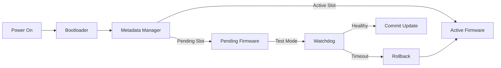
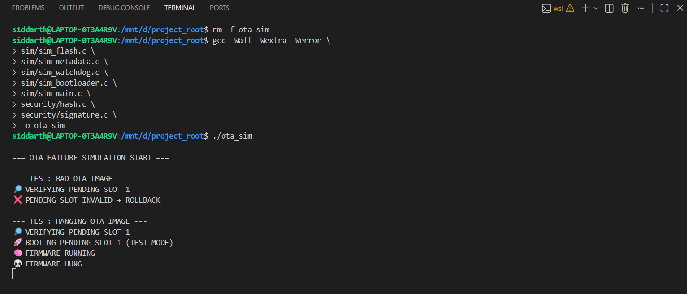

# 🔐 Secure OTA Update System (Embedded Simulation)

> A **production-grade Secure OTA (Over-The-Air) firmware update system** simulated in C, designed to demonstrate how **real embedded devices update safely without bricking**, even under failures or attacks.


## 🚀 Why this project exists

Most OTA demos stop at:
- copying firmware
- rebooting blindly

That approach **bricks devices in production**.

This project **explicitly defends against**:

- ❌ Tampered firmware images  
- ❌ Rollback / downgrade attacks  
- ❌ Power loss during update  
- ❌ Metadata corruption  
- ❌ Firmware that boots but hangs  

---

## 🧠 System Architecture – Secure OTA Flow

```md
## 🧱 System Architecture – Block Diagram


📸 OTA Simulation Output (Validated Results)

The following outputs were captured from the actual execution of this Secure OTA simulation, demonstrating correct behavior under failure conditions.





👤 Author

Project Developed By:
Siddarth S

Domain: Embedded Systems · Firmware · Secure OTA

Focus: Reliability, safety, and production-grade design
