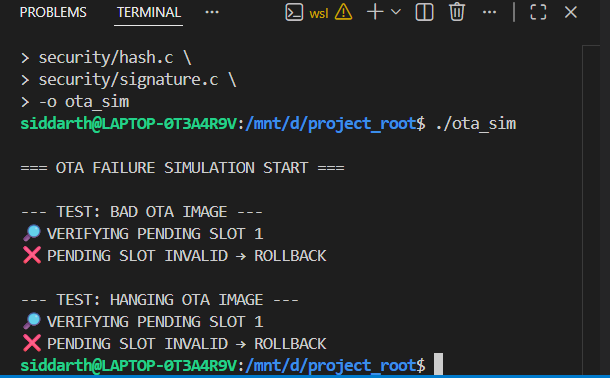

# 🔐 Secure OTA Update System (Embedded Simulation)

> A **production-grade Secure OTA (Over-The-Air) firmware update system** simulated in C, designed to demonstrate how **real embedded devices update safely without bricking**, even under failures or attacks.

This is **NOT a toy OTA project**.  
It models how professional bootloaders in real devices work.

---

## 🚀 Why this project exists

Most OTA demos stop at:
- copying firmware
- rebooting blindly

That approach **bricks devices in production**.

This project **explicitly defends against**:

- ❌ Tampered firmware images  
- ❌ Rollback / downgrade attacks  
- ❌ Power loss during update  
- ❌ Metadata corruption  
- ❌ Firmware that boots but hangs  

---

## 🧠 System Architecture – Secure OTA Flow

```mermaid
flowchart TD
    A[Power On / Reset] --> B[Bootloader Start]

    B --> C{Metadata Valid?}
    C -- No --> F[Boot Factory Firmware]
    C -- Yes --> D{OTA State?}

    D -- IDLE --> E[Verify Active Slot]
    E -- Invalid --> F
    E -- Valid --> G[Boot Active Firmware]

    D -- COMMIT_PENDING --> H[Verify Pending Slot]
    D -- BOOT_TEST --> H

    H -- Invalid --> I[Rollback to Active Slot]
    I --> F

    H -- Valid --> J[Boot Pending Firmware<br/>(Test Mode)]

    J --> K{Firmware Healthy?}
    K -- Yes --> L[Commit Firmware<br/>Update Metadata]
    L --> M[Boot Success]

    K -- No --> N[Watchdog Timeout]
    N --> I

    F --> M

```
📸 OTA Simulation Output (Validated Results)

The following outputs were captured from the actual execution of this Secure OTA simulation, demonstrating correct behavior under failure conditions.



👤 Author

Project Developed By:
Siddarth S

Domain: Embedded Systems · Firmware · Secure OTA
Focus: Reliability, safety, and production-grade design